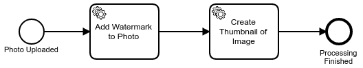
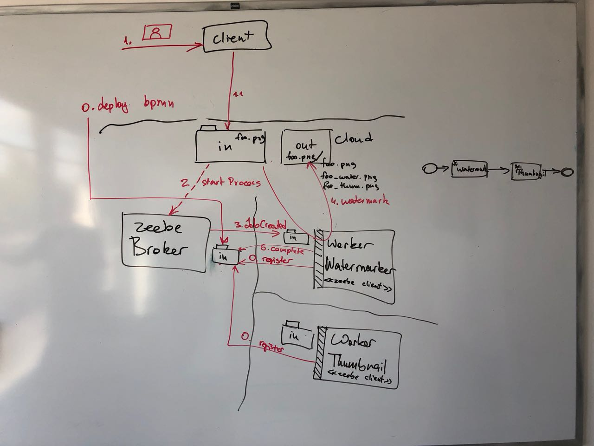
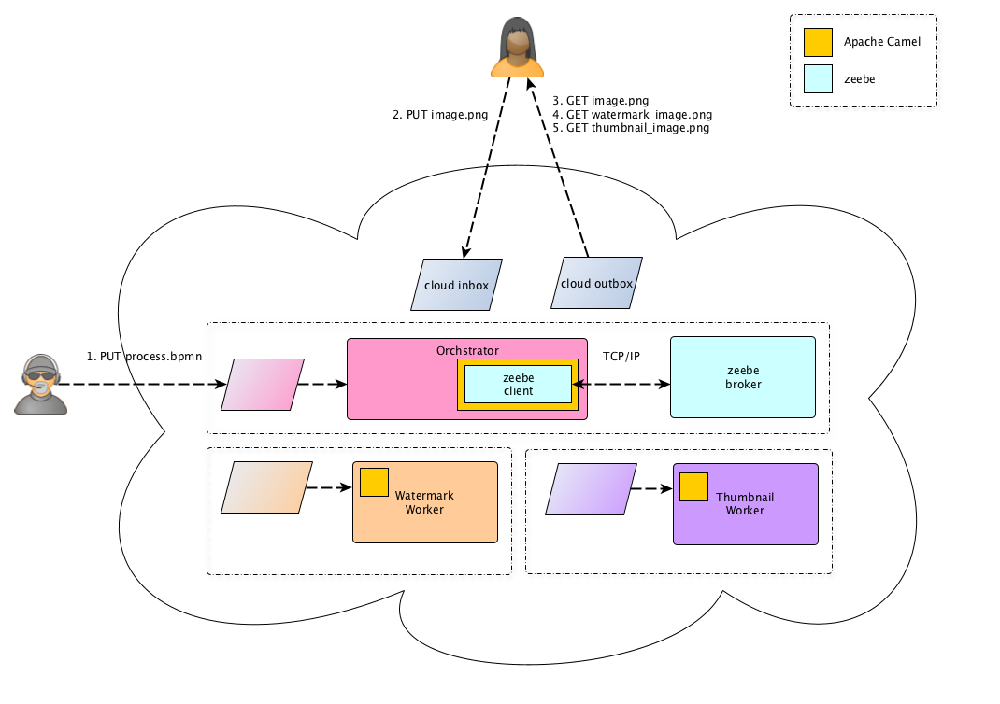
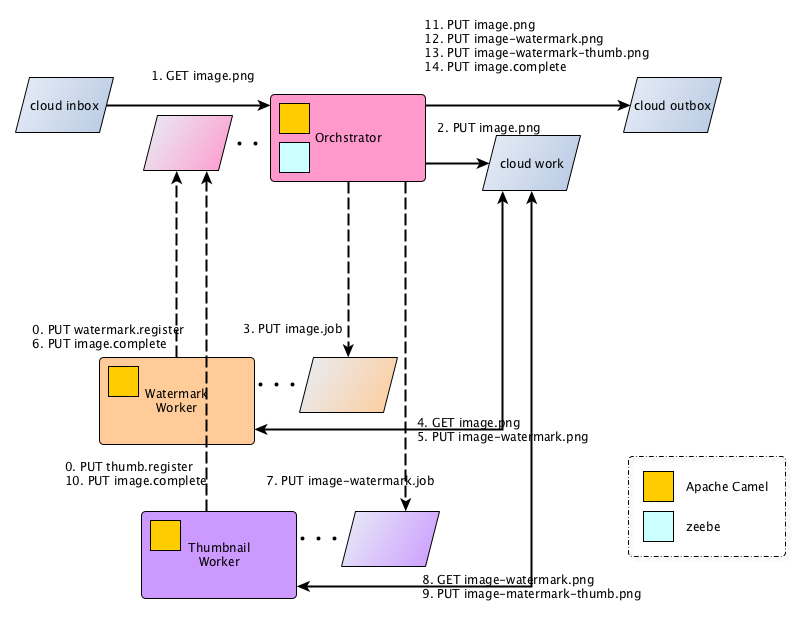

zeebe example based on https://github.com/zeebe-io/zb-facebam

showing

* spring zeebe starters
* camel-zeebe routing

## The process

Simple enough: for an image provided, add a watermark and create a thumbnail.

## Architecture

## Dynamic view

