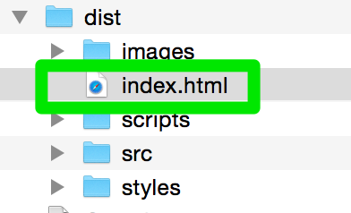

# Holisticon reveal.js master 

[](https://dev.holisticon.de/jenkins/job/Holisticon/job/holisticon-reveal/job/master/)
[Try the most recent snapshot](https://dev.holisticon.de/jenkins/job/Holisticon/job/holisticon-reveal/job/master/ws/dist/index.html)

## Setup

This part is only need if you want to build the presentation locally. If you stick to use Jenkins, you can skip this!

### Linux / OS/X
- Install `npm` (v4.4+)
- Open a shell in the project directory.

```
$ npm start

```

## Start a new presentation

1. Create new branch in [Gitlab](https://server.holisticon.de/gitlab/holisticon/holisticon-revealjs/branches/new)
2. Checkout the [project](https://server.holisticon.de/gitlab/holisticon/holisticon-revealjs) and switch to the branch `git checkout my_presentation`
3. Create your presentation: Edit the file **src/slides/slides.md**, see [sample presentation] for instruction how to use the template
4. Commit your changes and push them
5. Trigger the [jenkins job](https://server.holisticon.de/jenkins/job/holisticon-revealjs/) or run locally for testing `grunt`
6. In folder `dist` you will find all artifacts which can be used without a webserver, e.g. in a ZIP file:
7.


## Folder Structure

This is a web project, using **Grunt** as build tool and **bower** as package manager (equivalent to **Maven** in Java Pojects). A few notes on folders and files for newbies:

|Resource|Description
|---|----
|````package.json````| packaging format for node.js applications
|````bower.json````| bower components configuration
|````Gruntfile.js````| Grunt buildfile
|````dist/````| sources generated by Grunt
|````node_modules/````| downloaded node modules
|````src/bower_components/````| downloaded bower components
|````src/index.html````|the master html file for the presentation

Please edit only these resources:

|Resource|Description
|---|----
|````src/code/````|place code snippets here. You may create subfolders.
|````src/samples/````|place samples here. You may create subfolders.
|````src/images/````|place images here. You may create subfolders.
|````src/slides/slides.md  ````| create your slide texts here. You only need to use basic formattings, like marking bolds, italics, headlines, fixed-widths or lists. Markdown and the project will do the rest for you.

If you need assistance with Markdown, there are turorials on the web. For most purposes, this is easy and fun. Please google for a tutorial, or play with the  examples in the slides.md file.

## Releasing

### HTML

To release your slides to a portable presentation without dependencies to grunt and the rest of the build-chain just type

```
/holisticon-revealjs$ grunt release
```

This will do the following steps:

- Concat and minify all css and javascript resources
- Inline all .md-Files as `<script type="text/template">` (this allows starting the presentation from the filesystem)
- (TODO: Inline all css/javascript/fonts/image resources so we result with a single fat html that can be sent around completly selfcontained presentation)

The optimized version is published to the `dist` directory.

### PDF

Need docker to run!

```
docker run --rm -v `pwd`:/pwd astefanutti/decktape /pwd/dist/index.html /pwd/dist/slides.pdf
```

## Usage

Now whenever you want to work on your presentation run `grunt server` in the project directory - your preferred
Browser should open now and refresh whenever you change your presentation. Prepare your presentation within slides.md ...

Key bindings
* Slides presentation: arrow keys or space
* Fullscreen: `f` or `F11`
* Leave fullscreen: `ESC`
* hide slides: `b`
* slides overview: `o` or `ESC`
* presentation mode: `s`

More details in the [wiki](https://wiki.holisticon.de/display/intern/Reveal.js)